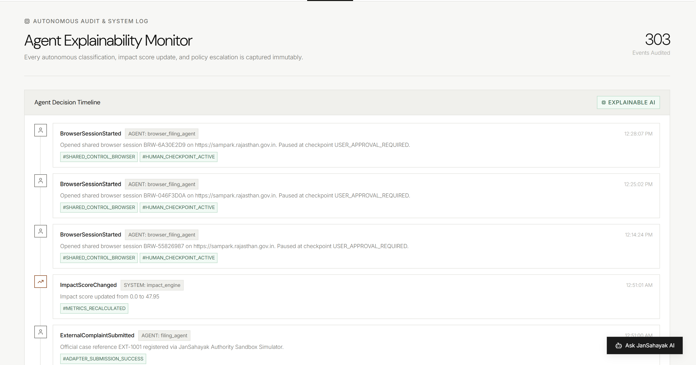
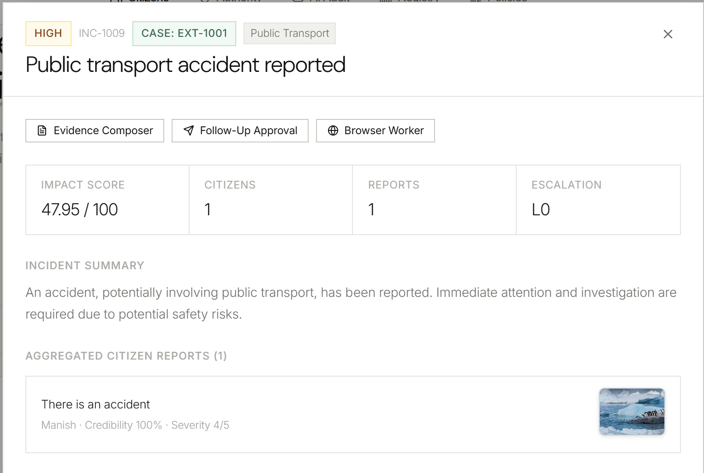
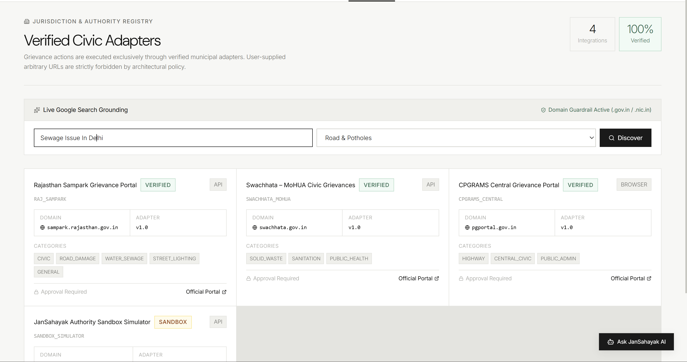
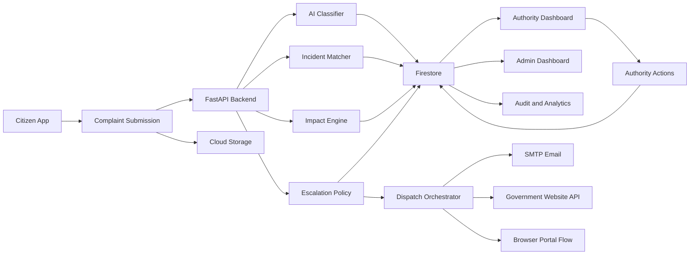
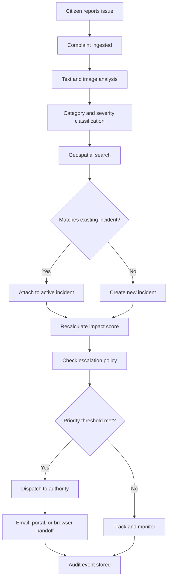
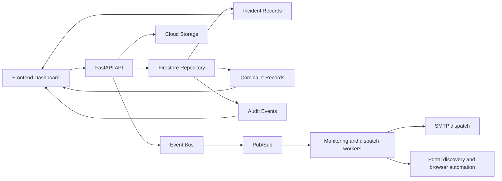
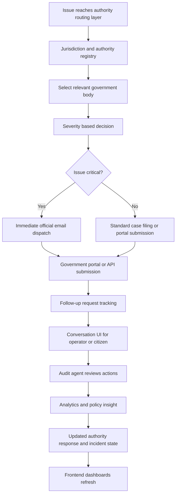

# JanSahayak

JanSahayak is an AI-powered civic issue management platform that helps citizens report local problems, groups related complaints into meaningful incidents, ranks their impact, and routes them to the right public authority with evidence-backed followups.

This project combines a FastAPI backend, a React frontend, and a set of AI-driven workflows for complaint classification, duplicate detection, geospatial clustering, risk scoring, and official grievance dispatch.

## Project screenshots

  

  

  

## What we are building

We are building a system that turns scattered citizen complaints into actionable civic incidents.

Instead of treating every complaint as a separate note, the platform looks for patterns such as location, category, urgency, and text similarity. When several reports point to the same pothole, garbage pile, broken streetlight, or sanitation problem, they are grouped into one incident. This creates a cleaner picture for city authorities and allows them to respond with better prioritization.

The product has three main layers:

- A citizen experience where people can report incidents with location, description, and evidence photos.
- An AI and rules engine that classifies reports, matches them to ongoing incidents, calculates impact, and checks escalation rules.
- A dashboard for authorities and administrators to review incidents, verify evidence, and send or track official responses.

## Why this project matters

Public service systems often struggle with fragmented complaint data. The same issue may be reported many times by different citizens, but without cleanup or prioritization it becomes hard for authorities to act.

This creates three common problems:

- Repeated complaints are not grouped, so the real scale of a problem is hidden.
- High-risk issues may be missed because low-volume reports do not stand out.
- Authorities receive incomplete information and have to investigate manually before taking action.

JanSahayak addresses this by combining AI, geospatial clustering, and operational workflows to help identify the most important issues faster and route them to the correct department.

## How we are building it

The system is built as a modular platform with a backend service layer, an event-driven workflow, and a frontend dashboard.

### Backend architecture

The backend is built with Python and FastAPI. It handles:

- Complaint ingestion from citizens
- AI-based classification and severity estimation
- Duplicate detection and incident matching
- Impact scoring and escalation policies
- Authority discovery and dispatch workflows
- Evidence storage and tracking
- Real-time incident data exposure to the frontend

### Frontend architecture

The frontend is built with React and Vite. It gives different user roles a view into the system:

- Citizen view for reporting and understanding nearby issues
- Authority dashboard for tracking active incidents and taking action
- Agent audit dashboard for reviewing AI decisions and operational events
- Admin policy page for configuring escalation logic and authority rules

### Core workflow

1. A citizen submits a complaint with description, location, and optionally images.
2. The backend classifies the issue category and urgency.
3. The complaint is compared with nearby incidents to determine if it belongs to an existing issue or starts a new incident.
4. The impact engine calculates urgency, risk, density, and priority.
5. The escalation policy decides whether the issue should stay local, escalate, or be dispatched to an authority.
6. The system may send an official complaint, use a browser-based portal flow, or store evidence for follow-up verification.

## High level system overview

## Complaint workflow

## Data and event flow

## Authority dispatch and audit loop

## Diagram notes

These diagrams are intended to explain the project at four different levels:

- architecture of the overall system
- lifecycle of one complaint
- movement of data and events across services
- routing, dispatch, follow-up, and audit operations

If you want, I can also turn these into a polished README section with a shorter intro under each diagram or convert them into a more presentation-friendly style.

## Product capabilities

### Complaint ingestion

Citizens can report issues with structured location and description fields. Images can be attached to strengthen evidence and assist AI review.

### Incident clustering

The platform groups nearby and semantically similar complaints into a single incident record. This allows repeated reports to be treated as one real issue with shared context.

### Impact analysis

Each incident is scored for severity, safety risk, density, persistence, and priority. This makes it easier to decide which issues need immediate action.

### Authority routing

The platform identifies the likely authority for the issue and can attempt official submissions via institutional email, portal discovery, or browser-based handoff.

### Direct API calls to government websites

For eligible civic workflows, the system can reach out directly to official government portals or complaint endpoints to submit issue details programmatically. This reduces manual filing work and helps move complaints into the real public grievance pipeline more quickly.

### Automated authority email dispatch

The platform can generate and send official emails to the relevant authority based on the severity, urgency, and category of an issue. SMTP is used to deliver evidence-backed complaint notices to the right government contact or grievance desk.

### Follow-up chat and request tracking

The product includes a conversational interface for follow-up requests, allowing operators or users to ask for status, request additional information, or trigger a new follow-up workflow. This is designed to keep complaint resolution moving without requiring a full manual process every time.

### Automated auditing and analytics

A specialised agent monitors complaint lifecycle events, dispatch actions, and follow-up outcomes for analytics and governance. This supports auditing, operational review, and insight generation around how issues are classified, escalated, and resolved.

### Jurisdiction and authority registry

Using a Gemini-powered search and discovery flow, the system can identify the correct jurisdiction, authority, and official channel for a local issue. This helps route complaints into the right department instead of sending them to an uncertain or generic contact.

### Observability and auditability

The system logs key events such as classification, matching, escalation, dispatch, and impact recalculation so agent decisions remain traceable.

## Technology stack

### Frontend

- React
- Vite
- TypeScript
- Lucide icons

### Backend

- Python
- FastAPI
- Pydantic
- Playwright
- Python dotenv
- Pytest

### AI and automation

- Google Gemini
- Vertex AI support
- Google Gen AI SDK
- Multimodal reasoning for image and text evidence
- Gemini-powered authority discovery and jurisdiction mapping
- AI-assisted audit and follow-up workflows

### Data and storage

- Cloud Firestore
- Cloud Storage
- Pub/Sub
- Google authentication

## Project structure

Rajuka/
- backend/
  - app/
    - agents/
    - api/
    - core/
    - events/
    - models/
    - repositories/
    - schemas/
    - services/
  - tests/
- frontend/
  - src/
  - public/

## Local setup

### Prerequisites

- Python 3.11+
- Node.js 18+
- A Google Cloud project or a configured Gemini API key
- Access to Firestore and Cloud Storage if using live Google services

### Backend setup

1. Open the backend folder.
2. Create and activate a virtual environment.
3. Install dependencies from requirements.txt.
4. Configure your environment variables in a .env file.
5. Start the API with uvicorn.

Example flow:

- cd backend
- python -m venv .venv
- .venv\Scripts\Activate
- pip install -r requirements.txt
- uvicorn app.main:app --reload

### Frontend setup

1. Open the frontend folder.
2. Install dependencies.
3. Start the Vite dev server.

Example flow:

- cd frontend
- npm install
- npm run dev

## Environment configuration

The project expects environment variables for Google AI and cloud services, including:

- GEMINI_API_KEY
- GEMINI_MODEL
- GOOGLE_GENAI_USE_VERTEXAI
- GCP_PROJECT_ID
- GCP_LOCATION
- GOOGLE_APPLICATION_CREDENTIALS
- STORAGE_BUCKET_NAME
- FIRESTORE_DATABASE_ID
- PUBSUB_TOPIC_PREFIX
- CORS_ORIGINS
- SMTP settings for dispatch workflows

## Google products we use

This project uses several Google technologies to power its AI, storage, message flow, and cloud operations.

### Google Gemini

Gemini is used for complaint classification, semantic matching, jurisdiction lookup, and reasoning over citizen reports and evidence. It helps interpret user text and image inputs to determine issue category, urgency, likely cluster membership, and the right authority channel.

### Google Gen AI SDK

The Google Gen AI SDK connects the Python backend to Gemini and related AI tooling. It is used to initialize the model client and run structured generation steps.

### Vertex AI

The project supports Vertex AI configuration through the Google Gen AI setup. This allows the same AI workflows to run through Google Cloud's managed AI platform when the environment is configured for it.

### Google AI Studio

Google AI Studio is the development path for obtaining and managing Gemini API keys for local or testing use. It is referenced in the environment configuration and is part of the typical setup for model access.

### Google Cloud Firestore

Firestore is the primary operational database for complaints, incidents, authorities, audit events, and policy state. It is used to persist structured records with a flexible document-based model.

### Google Cloud Storage

Cloud Storage is used for evidence files such as complaint images and uploaded documents. It provides durable storage for files attached to incidents and later review workflows.

### Google Cloud Pub/Sub

Pub/Sub is used for event-driven messaging between services and workflows. It supports asynchronous processing and helps decouple the incident lifecycle from direct synchronous calls.

### Google Cloud Authentication

The project uses Google authentication mechanisms and service account configuration through GOOGLE_APPLICATION_CREDENTIALS. This allows secure access to Google Cloud resources in production and local cloud-linked setups.

### Google Search Grounding

The portal and authority discovery workflows use Google search grounding with Gemini to find likely official complaint channels for a given location and issue category. This helps map civic issues to real government grievance portals, verified department channels, and jurisdiction-specific authority registries.

### Google Cloud Project and GCP environment

The application is designed to run in a Google Cloud environment with project-level settings for location, storage, identity, and service configuration. This is especially relevant for Firestore, Storage, Pub/Sub, and AI access.

## Why this is a good fit for civic tech

This project sits at the intersection of public service operations, citizen engagement, and AI automation. It helps reduce the noise in complaint systems while still preserving human review and authority accountability.

By combining AI triage with operational dispatch, the platform can be useful for:

- Municipal monitoring teams
- Ward-level civic operations
- Complaint redressal portals
- Public service analytics
- Evidence-based grievance follow-up

## Roadmap

Possible next steps for the project include:

- Real production deployment on Google Cloud
- More robust authority registry mapping
- Better multilingual complaint handling
- Stronger evidence validation for image-based incidents
- Admin dashboards for service-level and city-level metrics
- API integration for real government grievance systems

## Summary

JanSahayak is designed to help cities move from scattered complaint reports to actionable public service operations. It brings together AI, geospatial signal, operational policy, and authority workflows so civic issues are not just reported, but understood, prioritized, and resolved.
